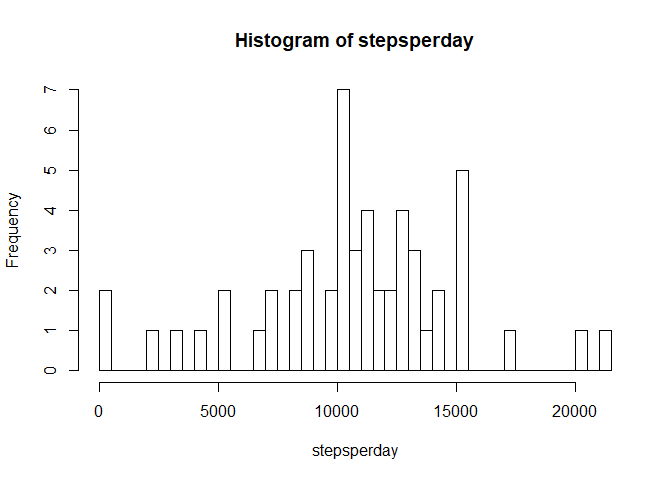
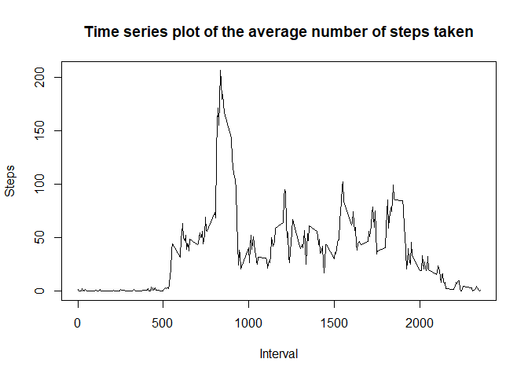

#Assignment Week 2

##Loading and preprocessing the data


```r
library(lubridate)
library(lattice)
library(chron)
library(tidyr)
library(ggplot2)
library(dplyr)
```

Open the Activity File and transform date in to a "Date format"


```r
data <- read.csv("activity.csv") ; data$date <- ymd(data$date)
head(data)
```

```
##   steps       date interval
## 1    NA 2012-10-01        0
## 2    NA 2012-10-01        5
## 3    NA 2012-10-01       10
## 4    NA 2012-10-01       15
## 5    NA 2012-10-01       20
## 6    NA 2012-10-01       25
```

##What is mean total number of steps taken per day?


```r
data2 <- na.omit(data)
aux <- split(data2[,1], data$date) #Split by day
```

```
## Warning in split.default(data2[, 1], data$date): largo de datos no es múltiplo
## de la variable de separación
```

```r
stepsperday <- sapply(aux, sum)
barplot(stepsperday, names.arg = unique(data$date), main = "Steps per day",
        xlab = "Days", ylab = "Steps", col = "darkgreen" )
```

<!-- -->

```r
avgstepsperday <- sapply(aux,mean) ;  avgstepsperday #Mean day
```

```
## 2012-10-01 2012-10-02 2012-10-03 2012-10-04 2012-10-05 2012-10-06 2012-10-07 
##  0.4375000 39.4166667 42.0694444 46.1597222 53.5416667 38.2465278 44.4826389 
## 2012-10-08 2012-10-09 2012-10-10 2012-10-11 2012-10-12 2012-10-13 2012-10-14 
## 34.3750000 35.7777778 60.3541667 43.1458333 52.4236111 35.2048611 52.3750000 
## 2012-10-15 2012-10-16 2012-10-17 2012-10-18 2012-10-19 2012-10-20 2012-10-21 
## 46.7083333 34.9166667 41.0729167 36.0937500 30.6284722 46.7361111 30.9652778 
## 2012-10-22 2012-10-23 2012-10-24 2012-10-25 2012-10-26 2012-10-27 2012-10-28 
## 29.0104167  8.6527778 23.5347222 35.1354167 39.7847222 17.4236111 34.0937500 
## 2012-10-29 2012-10-30 2012-10-31 2012-11-01 2012-11-02 2012-11-03 2012-11-04 
## 53.5208333 36.8055556 36.7048611 36.2465278 28.9375000 44.7326389 11.1770833 
## 2012-11-05 2012-11-06 2012-11-07 2012-11-08 2012-11-09 2012-11-10 2012-11-11 
## 43.7777778 37.3784722 25.4722222  0.1423611 18.8923611 49.7881944 52.4652778 
## 2012-11-12 2012-11-13 2012-11-14 2012-11-15 2012-11-16 2012-11-17 2012-11-18 
## 30.6979167 15.5277778 44.3993056 70.9270833 73.5902778 50.2708333 41.0902778 
## 2012-11-19 2012-11-20 2012-11-21 2012-11-22 2012-11-23 2012-11-24 2012-11-25 
## 38.7569444 47.3819444 35.3576389 24.4687500        NaN        NaN        NaN 
## 2012-11-26 2012-11-27 2012-11-28 2012-11-29 2012-11-30 
##        NaN        NaN        NaN        NaN        NaN
```

```r
medianstepsperday <- sapply(aux,median); medianstepsperday #Median day
```

```
## 2012-10-01 2012-10-02 2012-10-03 2012-10-04 2012-10-05 2012-10-06 2012-10-07 
##          0          0          0          0          0          0          0 
## 2012-10-08 2012-10-09 2012-10-10 2012-10-11 2012-10-12 2012-10-13 2012-10-14 
##          0          0          0          0          0          0          0 
## 2012-10-15 2012-10-16 2012-10-17 2012-10-18 2012-10-19 2012-10-20 2012-10-21 
##          0          0          0          0          0          0          0 
## 2012-10-22 2012-10-23 2012-10-24 2012-10-25 2012-10-26 2012-10-27 2012-10-28 
##          0          0          0          0          0          0          0 
## 2012-10-29 2012-10-30 2012-10-31 2012-11-01 2012-11-02 2012-11-03 2012-11-04 
##          0          0          0          0          0          0          0 
## 2012-11-05 2012-11-06 2012-11-07 2012-11-08 2012-11-09 2012-11-10 2012-11-11 
##          0          0          0          0          0          0          0 
## 2012-11-12 2012-11-13 2012-11-14 2012-11-15 2012-11-16 2012-11-17 2012-11-18 
##          0          0          0          0          0          0          0 
## 2012-11-19 2012-11-20 2012-11-21 2012-11-22 2012-11-23 2012-11-24 2012-11-25 
##          0          0          0          0         NA         NA         NA 
## 2012-11-26 2012-11-27 2012-11-28 2012-11-29 2012-11-30 
##         NA         NA         NA         NA         NA
```

##What is the average daily activity pattern?


```r
aux1 <- split(data2[,1], unique(data$interval))
avgstepperinterval <- sapply(aux1,mean, na.rm = TRUE)
plot(unique(data$interval), avgstepperinterval, type = "l", main = "Time series plot of the average number of steps taken",
     xlab = "Interval", ylab = "Steps")
```

<!-- -->

###Which 5-minute interval, on average across all the days in the dataset, contains the maximum number of steps?


```r
max1 <- sapply(aux1, mean)
which.max(as.integer(max1))
```

```
## [1] 104
```

```r
names(aux1[which.max(as.integer(max1))])
```

```
## [1] "835"
```

##Imputing missing values


### Calculate and report the total number of missing values in the dataset (i.e. the total number of rows with NAs)

```r
sum(is.na(data))
```

```
## [1] 2304
```

###Devise a strategy for filling in all of the missing values in the dataset. The strategy does not need to be sophisticated. For example, you could use the mean/median for that day, or the mean for that 5-minute interval, etc.

The missing value are change with mean of the all observations

```r
cM <- mean(data[,1], na.rm=TRUE)
indx <- which(is.na(data), arr.ind=TRUE)
data[indx] <- cM[indx[,2]]
head(data)
```

```
##     steps       date interval
## 1 37.3826 2012-10-01        0
## 2 37.3826 2012-10-01        5
## 3 37.3826 2012-10-01       10
## 4 37.3826 2012-10-01       15
## 5 37.3826 2012-10-01       20
## 6 37.3826 2012-10-01       25
```

###Make a histogram of the total number of steps taken each day and Calculate and report the mean and median total number of steps taken per day. Do these values differ from the estimates from the first part of the assignment? What is the impact of imputing missing data on the estimates of the total daily number of steps?


```r
data <- read.csv("activity.csv") ; data$date <- ymd(data$date) ; data <- na.omit(data)
aux <- split(data[,1], data$date) #Split by day
stepsperday <- sapply(aux, sum)
barplot(stepsperday, names.arg = unique(data$date), main = "Steps per day",
        xlab = "Days", ylab = "Steps", col = "darkgreen" )
```

<!-- -->

```r
avgstepsperday <- sapply(aux,mean) ;  avgstepsperday #Mean day
```

```
## 2012-10-02 2012-10-03 2012-10-04 2012-10-05 2012-10-06 2012-10-07 2012-10-09 
##  0.4375000 39.4166667 42.0694444 46.1597222 53.5416667 38.2465278 44.4826389 
## 2012-10-10 2012-10-11 2012-10-12 2012-10-13 2012-10-14 2012-10-15 2012-10-16 
## 34.3750000 35.7777778 60.3541667 43.1458333 52.4236111 35.2048611 52.3750000 
## 2012-10-17 2012-10-18 2012-10-19 2012-10-20 2012-10-21 2012-10-22 2012-10-23 
## 46.7083333 34.9166667 41.0729167 36.0937500 30.6284722 46.7361111 30.9652778 
## 2012-10-24 2012-10-25 2012-10-26 2012-10-27 2012-10-28 2012-10-29 2012-10-30 
## 29.0104167  8.6527778 23.5347222 35.1354167 39.7847222 17.4236111 34.0937500 
## 2012-10-31 2012-11-02 2012-11-03 2012-11-05 2012-11-06 2012-11-07 2012-11-08 
## 53.5208333 36.8055556 36.7048611 36.2465278 28.9375000 44.7326389 11.1770833 
## 2012-11-11 2012-11-12 2012-11-13 2012-11-15 2012-11-16 2012-11-17 2012-11-18 
## 43.7777778 37.3784722 25.4722222  0.1423611 18.8923611 49.7881944 52.4652778 
## 2012-11-19 2012-11-20 2012-11-21 2012-11-22 2012-11-23 2012-11-24 2012-11-25 
## 30.6979167 15.5277778 44.3993056 70.9270833 73.5902778 50.2708333 41.0902778 
## 2012-11-26 2012-11-27 2012-11-28 2012-11-29 
## 38.7569444 47.3819444 35.3576389 24.4687500
```

```r
medianstepsperday <- sapply(aux,median); medianstepsperday #Median day
```

```
## 2012-10-02 2012-10-03 2012-10-04 2012-10-05 2012-10-06 2012-10-07 2012-10-09 
##          0          0          0          0          0          0          0 
## 2012-10-10 2012-10-11 2012-10-12 2012-10-13 2012-10-14 2012-10-15 2012-10-16 
##          0          0          0          0          0          0          0 
## 2012-10-17 2012-10-18 2012-10-19 2012-10-20 2012-10-21 2012-10-22 2012-10-23 
##          0          0          0          0          0          0          0 
## 2012-10-24 2012-10-25 2012-10-26 2012-10-27 2012-10-28 2012-10-29 2012-10-30 
##          0          0          0          0          0          0          0 
## 2012-10-31 2012-11-02 2012-11-03 2012-11-05 2012-11-06 2012-11-07 2012-11-08 
##          0          0          0          0          0          0          0 
## 2012-11-11 2012-11-12 2012-11-13 2012-11-15 2012-11-16 2012-11-17 2012-11-18 
##          0          0          0          0          0          0          0 
## 2012-11-19 2012-11-20 2012-11-21 2012-11-22 2012-11-23 2012-11-24 2012-11-25 
##          0          0          0          0          0          0          0 
## 2012-11-26 2012-11-27 2012-11-28 2012-11-29 
##          0          0          0          0
```

###Create a new factor variable in the dataset with two levels -- "weekday" and "weekend" indicating whether a given date is a weekday or weekend day


```r
data$isweekend <- is.weekend(data$date)
data[,4] <- as.numeric(data[,4])
data$isweekend[data$isweekend == 0] <- "Weekday" ; data$isweekend[data$isweekend == 1] <- "Weekend"
head(data)
```

```
##     steps       date interval isweekend
## 289     0 2012-10-02        0   Weekday
## 290     0 2012-10-02        5   Weekday
## 291     0 2012-10-02       10   Weekday
## 292     0 2012-10-02       15   Weekday
## 293     0 2012-10-02       20   Weekday
## 294     0 2012-10-02       25   Weekday
```
###Make a panel plot containing a time series plot (i.e. type = "l") of the 5-minute interval (x-axis) and the average number of steps taken, averaged across all weekday days or weekend days (y-axis). The plot should look something like the following, which was created using simulated data:


```r
aux3 <- split(data[,1], list(data$isweekend, data$interval))
aux4 <- sapply(aux3, mean)
data2 <- data.frame("days" = names(aux3), "steps" = aux4, row.names = NULL)
data2 <- data2 %>% separate(days, c("isweekend", "interval"))
data2$isweekend <- as.factor(data2$isweekend)
g <- qplot(as.numeric(data2$interval), data2$steps, data = data2, facets = .~isweekend, na.rm = TRUE, type = "l")
```

```
## Warning: Ignoring unknown parameters: type
```

```r
g + scale_x_continuous(breaks = seq(0, 2355, by =250)) +
labs(title = "Average steps per interval", x = "Interval", y = "Steps") +  geom_line(linetype = "solid")
```

<!-- -->


