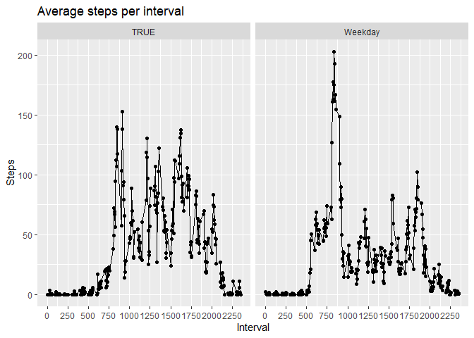

#Assignment Week 2

##Loading and preprocessing the data


```r
library(lubridate)
library(lattice)
library(chron)
library(tidyr)
library(ggplot2)
library(dplyr)
```

Open the Activity File and transform date in to a "Date format"


```r
data <- read.csv("activity.csv") ; data$date <- ymd(data$date)
head(data)
```

```
##   steps       date interval
## 1    NA 2012-10-01        0
## 2    NA 2012-10-01        5
## 3    NA 2012-10-01       10
## 4    NA 2012-10-01       15
## 5    NA 2012-10-01       20
## 6    NA 2012-10-01       25
```

##What is mean total number of steps taken per day?


```r
data <- na.omit(data)
stepsperday <- tapply(data$steps,data$date,sum, na.rm = TRUE)
hist(stepsperday, breaks = 53)
```

<!-- -->

```r
meanstepsperday <- mean(stepsperday); meanstepsperday
```

```
## [1] 10766.19
```

```r
medianstepsperdat <- median(stepsperday); medianstepsperdat
```

```
## [1] 10765
```

##What is the average daily activity pattern?


```r
data2 <- na.omit(data)
aux1 <- split(data2[,1], unique(data$interval))
avgstepperinterval <- sapply(aux1,mean, na.rm = TRUE)
plot(unique(data$interval), avgstepperinterval, type = "l", main = "Time series plot of the average number of steps taken",
     xlab = "Interval", ylab = "Steps")
```

<!-- -->

###Which 5-minute interval, on average across all the days in the dataset, contains the maximum number of steps?


```r
max1 <- sapply(aux1, mean)
which.max(as.integer(max1))
```

```
## [1] 104
```

```r
names(aux1[which.max(as.integer(max1))])
```

```
## [1] "835"
```

##Imputing missing values


### Calculate and report the total number of missing values in the dataset (i.e. the total number of rows with NAs)

```r
sum(is.na(data))
```

```
## [1] 0
```

###Devise a strategy for filling in all of the missing values in the dataset. The strategy does not need to be sophisticated. For example, you could use the mean/median for that day, or the mean for that 5-minute interval, etc.

The missing value are change with mean of the all observations

```r
data <- read.csv("activity.csv")
stepsperday_aux <- tapply(data$steps,data$date,sum, na.rm = TRUE)
data$aux <- stepsperday_aux[match(data$date, names(stepsperday_aux))]
data$steps <- coalesce(data$steps,data$aux)
stepsperday_mean <- tapply(data$steps,data$date,sum, na.rm = TRUE)
```


###Make a histogram of the total number of steps taken each day and Calculate and report the mean and median total number of steps taken per day. Do these values differ from the estimates from the first part of the assignment? What is the impact of imputing missing data on the estimates of the total daily number of steps?


```r
par(mfrow = c(1,2), mar = c(4,4,2,1))
hist(stepsperday_mean, breaks = 61)
hist(stepsperday, breaks = 53)
```

<!-- -->

```r
meanstepsperday_mean <- mean(stepsperday_mean); meanstepsperday_mean; meanstepsperday
```

```
## [1] 9354.23
```

```
## [1] 10766.19
```

```r
medianstepsperdat_median <- median(stepsperday_mean); medianstepsperdat_median ; medianstepsperdat
```

```
## [1] 10395
```

```
## [1] 10765
```

The histogram, the mean and the median are different since I enter values where there were none and the calculation of these differs since in this case there are full days that have no observations, so by adding the average of these days that is 0 , I am simply dividing the number of total steps into more days. So it is totally different

###Create a new factor variable in the dataset with two levels -- "weekday" and "weekend" indicating whether a given date is a weekday or weekend day


```r
data$isweekend <- is.weekend(data$date)
data[,4] <- as.numeric(data[,4])
data$isweekend[data$isweekend == 0] <- "Weekday" ; data$isweekend[data$isweekend == 1] <- "Weekend"
head(data)
```

```
##   steps       date interval aux isweekend
## 1     0 2012-10-01        0   0   Weekday
## 2     0 2012-10-01        5   0   Weekday
## 3     0 2012-10-01       10   0   Weekday
## 4     0 2012-10-01       15   0   Weekday
## 5     0 2012-10-01       20   0   Weekday
## 6     0 2012-10-01       25   0   Weekday
```
###Make a panel plot containing a time series plot (i.e. type = "l") of the 5-minute interval (x-axis) and the average number of steps taken, averaged across all weekday days or weekend days (y-axis). The plot should look something like the following, which was created using simulated data:


```r
aux3 <- split(data[,1], list(data$isweekend, data$interval))
aux4 <- sapply(aux3, mean)
data2 <- data.frame("days" = names(aux3), "steps" = aux4, row.names = NULL)
data2 <- data2 %>% separate(days, c("isweekend", "interval"))
data2$isweekend <- as.factor(data2$isweekend)
g <- qplot(as.numeric(data2$interval), data2$steps, data = data2, facets = .~isweekend, na.rm = TRUE, type = "l")
```

```
## Warning: Ignoring unknown parameters: type
```

```r
g + scale_x_continuous(breaks = seq(0, 2355, by =250)) +
labs(title = "Average steps per interval", x = "Interval", y = "Steps") +  geom_line(linetype = "solid")
```

<!-- -->


